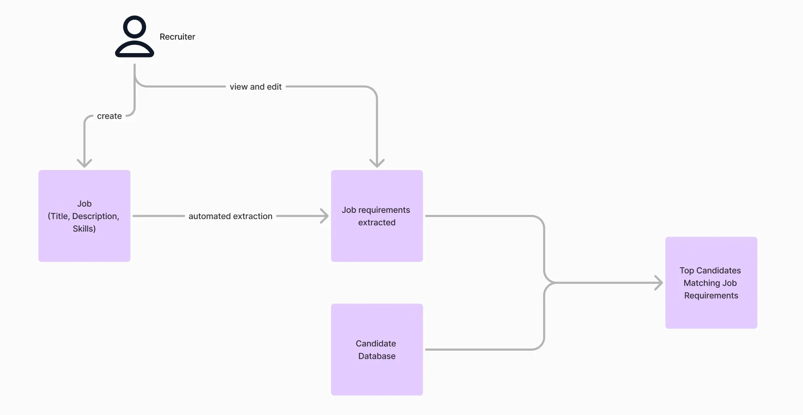

# Build a simple Recommendation Engine (Candidate X Jobs) - Manatal Hiring Challenge - Senior Data Scientist

## Introduction

Thank you for your interest in joining our team at Manatal.

As part of our evaluation process, we've designed this take-home challenge to understand how you approach complex problems and implement solutions in a real-world context.

## Purpose

This exercise will allow you to demonstrate your end-to-end capabilities in designing and implementing an ML/AI solution from scratch, similar to the challenges you'll face in our team.

We will evaluate your abilities in the following key areas:

1. **Problem Analysis & Research**
    - Understanding and breaking down complex requirements
    - Researching and evaluating existing solutions
    - Identifying potential challenges and constraints
2. **Solution Architecture**
    - Designing a scalable and maintainable solution
    - Making well-reasoned technical decisions
    - Balancing functional requirements with technical constraints
3. **Implementation & Technical Skills**
    - Creating a working MVP that demonstrates core functionality
    - Writing clean, well-documented code using best practices and design patterns
    - Maintain code quality and readability
    - Applying ML/AI best practices and patterns
4. **Communication & Presentation**
    - Clearly articulating technical decisions and trade-offs
    - Presenting solutions to technical stakeholders
    - Responding to technical questions and feedback effectively

## Challenge

The CEO of a growing recruitment agency, has approached us with an exciting challenge. His agency has:

- Built a premium database of 100,000+ vetted candidates
- Established relationships with top companies posting regular job openings
- A need to accelerate their matching process while maintaining quality

Their goal is to leverage AI to instantly identify the most promising candidates for each new job opening, enabling their recruiters to act quickly and maintain their competitive edge.

They built a simple prototype of how the solution could look like:

Given a **Job,** they want you to return the top 100 candidates that fit the best with the **Job**.

You are responsible for designing and implementing an intelligent recommendation engine that can:

1. Process and understand job requirements automatically
2. Match these requirements against a large candidate database
3. Return a ranked list of the most suitable candidates

Anything related to frontend or UX/UI is out of scope as they have an internal engineering team composed of frontend engineering to build it.

## Functional Requirements

- The recommendation should take into account the Job requirements extracted using the job title, job description, and job-required skills.
- The recommendation should take into account the Candidate’s details including the list of experiences, the list of education and the list of skills.
- The recommendation engine should take into account semantics. (e.g. a candidate with experience in Flask should be considered as experienced in Python to some extent even if he does not mention it explicitly in his profile).
- There should be an intermediary step allowing the recruiter to adjust the requirements extracted from the job. (see diagram below)

- Bonus: Given a recommended candidate for the job, we want to display the key reasons why the candidate has been recommended.

## Non Functional Requirements

1. **Performance**
    - Response time: <15 seconds for 100K candidate database (Time from request to display top candidate for a given job to generate and return response to user interface)
    - Assume asynchronous candidate profile processing (e.g. create embeddings, extraction of job requirements from job description, etc.)
2. **Quality**
    - Satisfactory matching accuracy
    - Handle edge cases and partial matches gracefully
    - Provide consistent results
3. **Technical**
    - Use one of the following languages: Python or Javascript.

## Deliverables

Please document any assumptions you make about the requirements.

1. **Design Document: (e.g. Notion, Slides, Miro, etc.)**
    - High-level architecture of your solution
    - Explanation of the matching algorithm
    - Discussion of AI approach including technical choices and trade-offs
    - Discussion of the infrastructure approach (e.g. data store, etc.)
    - Discussion of the semantic matching approach details
    - Potential improvements and scaling considerations
2. **Working Prototype (e.g. code repository)**
    - Implementation of the core matching engine
    - Include code for processing candidates (e.g. generation of embeddings)
    - Basic API or interface to interact with the system (e.g Streamlit, etc.)
3. **Dataset Requirements**
    - You may use synthetic data for demonstration
    - Include at least 100 sample candidate profiles
    - Include at least 2 jobs

## Expectation

We respect your time and suggest spending no more than 6 hours on this challenge. It's more important to demonstrate your thought process and approach than to create a perfect solution.

After submission, you'll have the opportunity to present your solution to our engineering team, followed by a Q&A session.

## References

Refer to [candidate desc](data/samples/candidate.json) AND [job desc](data/samples/job.json)